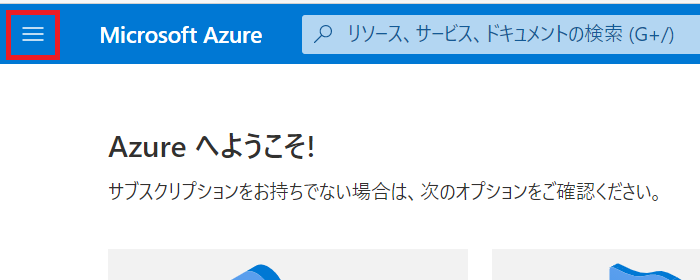
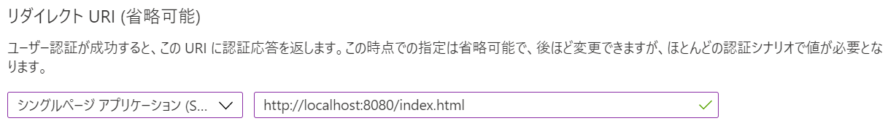
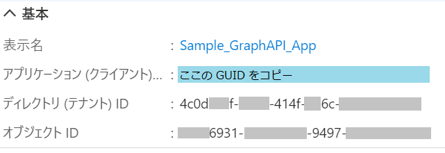
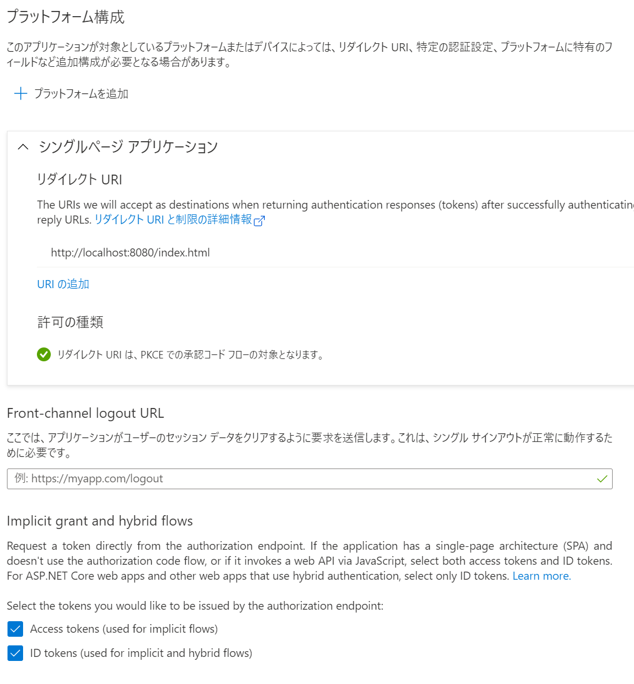

# 演習 1 : Azure Active Directory へのアプリケーションの登録

Microsoft Graph API を使用するためにはこれを使用するアプリケーションを Azure Active Airectory に登録し、管理できるようにする必要があります。

これによりアプリケーションからの認証の要求の処理や、アクセス権の決定、トークンの発行などが行えるようになります。

Azure Active Airectory は Azure や Office 365 や Dynamics 365 といった Microsoft の SaaS サービスのアカウント管理だけなく、開発者が新たに開発するアイデンティティ管理のプラットフォームとして利用することができます。

このようにアプリケーションから利用可能な Azure Active Airectory のアイデンティティ管理基盤を[Microsoft ID プラットフォーム](https://docs.microsoft.com/ja-jp/azure/active-directory/develop/v2-overview)と呼びます。

## このアプリケーションの認証フロー

この演習で作成するアプリケーションの認証フローは暗黙的なフローを使用します。

【注意】この手順は将来的によりセキュアな[OAuth 2.0 認証コード フローを使用するもの]((https://docs.microsoft.com/ja-jp/azure/active-directory/develop/quickstart-v2-javascript-auth-code))に置き換えられます。
  

アプリケーションから Azure Active Airectory の認証機能を利用するための登録方法は以下の手順で行います。

なお、この設定は**アプリケーションの作成前でも作成後でも行えます**が、アプリケーションのコード内に Azure Active Airectory 登録時に生成される ID 等を記述する必要があるのであらかじめ行っておいたほうが手戻りは少なくなります。

## Azure Active Airectory への SPA アプリケーションの登録

1. Azure のポータルにログインします

2. 左上にあるハンバーガーメニューをクリックしてメニュー ブレードを表示し **[Azure Active Directory]** を選択します

    

3. Azure AD のブレードより **\[アプリの登録\]** をクリックします

4. アプリの登録画面が表示されるので画面上部の **\[+ 新規登録\]** メニューをクリックします

    

5. アプリケーションの登録画面が表示されるので **\[名前\]** にアプリケーション名を入力します

    この演習では "**Sample_GraphAPI_App**" という名前を使用します。なお、この名前は後で変更することができます

6. \[サポートされているアカウントの種類\] で、 **\[任意の組織ディレクトリ内のアカウント (任意の Azure AD ディレクトリ - マルチテナント) と個人の Microsoft アカウント (Skype、Xbox など)\]**を選択します

7. \[リダイレクト URI (省略可能)\] のドロップダウンリストから **\[シングルページ アプリケーション\]** を選択し、右側のテキストボックスに以下の URL を記述します

    **http://localhost:8080/index.html**

    ここに指定する URL は https で始まる必要がありますが localhost アドレスは例外的に http が使用できます。 

    

8. [登録] ボタンをクリックします。

9. 画面左のメニューの \[概要\] をクリックし、表示された画面で **\[アプリケーション (クライアント)\]** の内容をコピーし、テキストファイルなどにメモします

    

10. 左側のメニューの \[管理\] セクションにある **\[認証\]**をクリックします

11. 表示された画面の \[プラットフォーム構成\]に "シングルページ アプリケーション" が追加されており、同ボックス内の \[リダイレクト URL\] に\[アプリケーションの登録\]で指定した URL が設定されていることを確認します

    なお、この設定は後から追加や変更をすることができます

12. **\[暗黙的な許可およびハイブリッド フロー\]** Implicit grant and hybrid flows) セクションで以下のチェックボックスにチェックをつけます

    - **Access tokens (used for implicit flows)** (ID トークン)
    - **ID tokens (used for implicit and hybrid flows)** (アクセス トークン)

    以下は実際の画面です。

    

13. 画面上部の\[保存\]メニューをクリックします

以上で認証を行うための Azure Active Airectory へのアプリケーションの登録は完了です。

  

[次へ ⇒ MSAL.js を使用したログイン処理の実装](Ex02.md)

[⇒ 戻る](Readme.md)