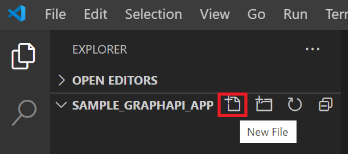
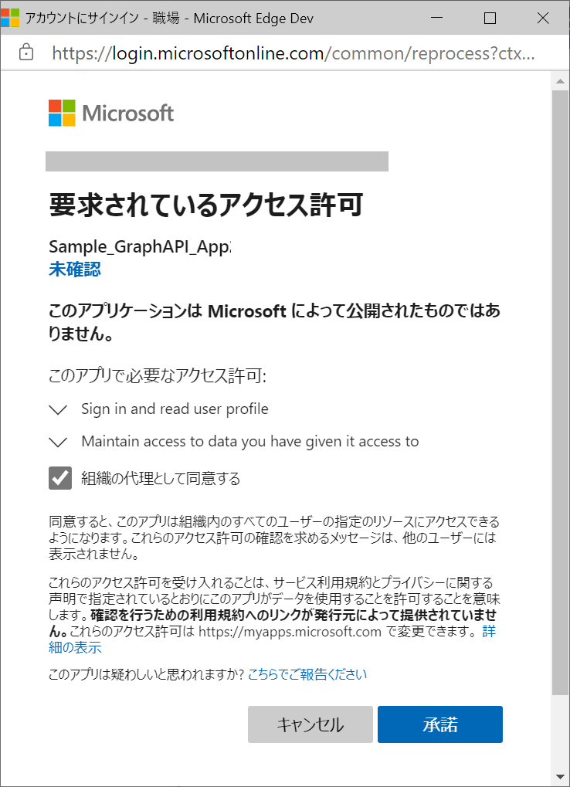

# 演習 2 : MSAL.js を使用したログイン処理の実装

この演習ではローカル環境に SPA (Single Page Application) を作成し、Azure Active Directory を使用した認証機能を実装します。

アプリケーションの処理としては以下のようになります。

1. MSAL を使用した Azure Active Airectory へのログイン
2. Azure Active Airectory から返される ID トークンの取得
3. ID トークン取得時に返されるユーザー情報の表示
4. Graph API にアクセスするためのアクセストークンの取得

## MSAL について
MSAL (Microsoft Authentication Library) を使用すると、ユーザーを認証し、Microsoft ID プラットフォーム エンドポイントからセキュリティで保護された Web API にアクセスするためのトークンを取得できます。 

これは、Microsoft Graph、その他の Microsoft API、サード パーティの Web API、または、独自の Web API へのセキュリティで保護されたアクセスを提供するために使用できます。 MSAL は、.NET、JavaScript、Java、Python、Android、iOS などの、さまざまなアプリケーション アーキテクチャとプラットフォームをサポートします。

詳細については以下のドキュメントを参照してください。

- [Microsoft Authentication Library (MSAL) の概要](https://docs.microsoft.com/ja-jp/azure/active-directory/develop/msal-overview)

この演習で使用するアプリケーションは認証処理に暗黙的フローを使用するので MSAL.js (Microsoft Authentication Library for JavaScript) 1.0 を使用します。 

## タスク1 : 演習用アプリケーションの作成と認証機能の実装

ローカルで実行可能な演習用の SPA を作成し Azure Active Airectory を使用した認証機能を実装します。

このアプリケーションでは Azure Active Airectory での認証後、ログインしたユーザーの表示名とアカウント名を表示します。

作成手順は以下のとおりです。

1. ローカルディスク上に **Sample_GraphAPI_App** という名前でフォルダを作成します

    この演習では解り易いようにフォルダ名を Azure Active Airectory に登録したアプリケーション名と同じにしましたが、とくに同じにしなければならないということはありません

2. 作成したフォルダを右クリックし、表示されたコンテキストメニューから **\[Codeで開く\]**を選択し、Visual Studio Code で開きます

    コンテキストメニューから \[Codeで開く\]が表示されない場合は、別途 Visual Studio Code を起動し、メニュー\[File\]-\[Open Folder\] を選択してフォルダをオープンしてください

3. 画面左のツリービュー内にあるフォルダ名 \[**Sample_GraphAPI_App**\] の右隣にある \[**New File**\]アイコンをクリックし、表示されたテキストボックスに **index.html** と入力してファイル index.html を作成します

    

4. 作成した index.html が編集状態になっていることを確認し、エディタ画面内で **!** と入力し、すぐにキーボードの \[Tab\] キーを押下して基本的な HTML タグを挿入します

5. 挿入されたタグ HTML タグの lang 属性を **ja** に変更します

6. title タグの下の行に、msal.js を参照するための以下のタグをコピーして貼り付けます

    ```
    <!-- msal.min.jsはmsal.jsの代わりに使用できます。デバッグを容易にするためにmsal.jsが含まれています -->
    <script src="https://alcdn.msauth.net/browser/2.7.0/js/msal-browser.js"
        integrity="sha384-5Fqyq1ncNYhL2mXCdWAFXkf2wWtKeA0mXYp++ryAX1lowD0ctAHFdity37L/ULXh"
        crossorigin="anonymous"></script>

    <!-- 信頼性を確保するために、マイクロソフトは 2 つ目の CDN を提供しています -->
    <script type="text/javascript">
        if (typeof Msal === 'undefined') document.write(unescape("%3Cscript src='https://alcdn.msftauth.net/browser/2.7.0/js/msal-browser.js' type='text/javascript' crossorigin='anonymous' %3E%3C/script%3E"));
    </script>
    ```

    キーボードの[Alt] + [Shift] + [F] キーを押下し、コードのインデントを整形します

7. 前の手順で記述した script タグの閉じタグの下で **script** とタイプして表示される **script:src** を選択します

    

8. script タグが挿入され src 属性の " (ダブルクォーテーション) 内にカーソルが移動するので **aadAuth.js** と記述します

9. 記述したファイル名 aadAuth.js を\[Crtl\] キーを押下しながらクリックすると"Unable to open 'aadAuth.js'" と書かれたメッセージボックスが表示されるので \[Create File\] ボタンをクリックします

10. aadAuth.js ファイルが作成され編集状態になるのでエディタ画面に以下のコードを貼り付けます

    ```
    /**
    * 作成時に MSAL インスタンスに渡される構成オブジェクト 
    * MSAL.js設定パラメータの完全なリストについては:
    * https://github.com/AzureAD/microsoft-authentication-library-for-js/blob/dev/lib/msal-browser/docs/configuration.md 
    */
    const msalConfig = {
        auth: {
            clientId: "%AADクライアントIDを記述%",
            authority: "https://login.microsoftonline.com/common",
            redirectUri: "http://localhost:8080/index.html",
        },
        cache: {
            cacheLocation: "sessionStorage", // キャッシュを保存する場所を構成
            storeAuthStateInCookie: false, // IE11 または Edge で問題が発生する場合は、この値を "true" に設定
        },
        system: {	
            loggerOptions: {	
                loggerCallback: (level, message, containsPii) => {	
                    if (containsPii) {		
                        return;		
                    }		
                    switch (level) {		
                        case msal.LogLevel.Error:		
                            console.error(message);		
                            return;		
                        case msal.LogLevel.Info:		
                            console.info(message);		
                            return;		
                        case msal.LogLevel.Verbose:		
                            console.debug(message);		
                            return;		
                        case msal.LogLevel.Warning:		
                            console.warn(message);		
                            return;		
                    }	
                }	
            }	
        }
    };

    // メインの myMSALObj インスタンスを生成
    const myMSALObj = new msal.PublicClientApplication(msalConfig);
    let username = "";

    /**
    * ここに追加したスコープは、サインイン時にユーザーの同意を求めます.
    * 既定では MSAL.js は OIDC スコープ (openid, profile, email) をすべてのログインリクエストに追加します.
    * OIDC スコープの詳細については、: 
    * https://docs.microsoft.com/en-us/azure/active-directory/develop/v2-permissions-and-consent#openid-connect-scopes
    */
    const loginRequest = {
        scopes: ["User.Read"]
    };

    /**
    * MS Graph API のアクセス トークンを取得するときに要求するスコープをここに追加します。詳細については:
    * https://github.com/AzureAD/microsoft-authentication-library-for-js/blob/dev/lib/msal-browser/docs/resources-and-scopes.md
    */
    const tokenRequest = {
        scopes: ["User.Read"],
        forceRefresh: false // キャッシュされたトークンをスキップし、サーバーに移動して新しいトークンを取得するには、これを "true" に設定します
    };

    function selectAccount() {
    /**
    * アカウント検索の詳細はこちらをご覧ください。: 
    * https://github.com/AzureAD/microsoft-authentication-library-for-js/blob/dev/lib/msal-common/docs/Accounts.md
     */

        const currentAccounts = myMSALObj.getAllAccounts();
        if (currentAccounts.length === 0) {
            return;
        } else if (currentAccounts.length > 1) {
            // Add choose account code here
            console.warn("Multiple accounts detected.");
        } else if (currentAccounts.length === 1) {
            username = currentAccounts[0].username;
        }
    }

    function handleResponse(response) {
    /**
     * レスポンスオブジェクトのプロパティの完全なリストは:
     * https://github.com/AzureAD/microsoft-authentication-library-for-js/blob/dev/lib/msal-browser/docs/request-response-object.md#response
     */
        if (response !== null) {
            let accoutInfo = response.account;
            username = accoutInfo.username;
            //ログイン済ユーザー情報を表示
            showPropertyName_and_Value(accoutInfo);
            //画面の表示を切り替える
            flip_flopDisplay(logOnButton, loginedArea);

            /* このコメントを演習 2-2 手順 3 のコードと置き換えます */  

        } else {
            selectAccount();
        }
    }

    function logon() {
    /**
     * 以下にカスタムリクエストオブジェクトを渡すことができます。これにより、初期設定が上書きされます。詳細はこちらをご覧ください。:
     * https://github.com/AzureAD/microsoft-authentication-library-for-js/blob/dev/lib/msal-browser/docs/request-response-object.md#request
     */
        myMSALObj.loginPopup(loginRequest)
        .then(handleResponse)
        .catch(error => {
            console.error(error);
        });
    }

    function logoff() {
    /**
     * 以下にカスタムリクエストオブジェクトを渡すことができます。これは初期設定を上書きします。詳細については、以下を参照してください:
     * https://github.com/AzureAD/microsoft-authentication-library-for-js/blob/dev/lib/msal-browser/docs/request-response-object.md#request
     */

        //ログアウトするアカウントを選択します。
        const logoutRequest = {
            account: myMSALObj.getAccountByUsername(username)
        };
        myMSALObj.logout(logoutRequest);
    }

    ```

    キーボードの\[Alt\] + \[Shift\] + \[F\] キーを押下し、コードのインデントを整形します

11. 貼り付けたコード中の **%AADクライアントIDを記述%** と書かれたところを Azure Active Airectory にアプリケーションの登録を行った際にメモしたクライアント ID で書き変え、キーボートの\[Crlt\] + \[S\]を押下して aadAuth.js への変更を保存します

12. エディタを **index.html** に切り替えます

13. body タグ内に以下のタグを貼り付けます
    ```
    <button id="logOnButton">ログイン</button>
    <div id="loginedArea" style="display: none;">
    
        <!--このコメントを演習 3-2 のステップ 6 のタグで置き換え-->
        <!--このコメントを演習 4-4 のステップ 2 のタグで置き換え-->
    
        <button id="logOffButton">ログオフ</button>
    </div>
    <br><br>
    <div id="display"></div>
    ```

14. body の閉じタグ下の行に以下の内容を貼り付けます
    ```
    <script>
    const $id = (id) => { return document.getElementById(id) };
    const loginedArea = $id('loginedArea'),
        display = $id('display');
    $id('logOnButton').addEventListener('click', logon);
    $id('logOffButton').addEventListener('click', logoff);

    /*このコメントを演習 3-2 のステップ 7 のコードで置き換え*/

    /*このコメントを演習 4-4 ステップ 3 のコードで置き換え*/

    //情報表示用のエレメントを追加
    function showItem(text){
        let elm = document.createElement('div');
        elm.innerText = text;
        display.appendChild(elm);
    }
    //表示、非表示が相反するコントロールの表示を切り替える
    function flip_flopDisplay(ctrl1, ctrl2) {
        ctrl1.style.display = ctrl2.style.display;
        ctrl2.style.display = (ctrl2.style.display === 'none') ? 'block' : 'none';
    }

    //プロパティ名と値を表示
    function showPropertyName_and_Value(objInfo) {
        for (var prop in objInfo) {
            showItem(`${prop} : ${objInfo[prop]}`);
        }
    }
    </script>
    ```

    キーボードの\[Alt\] + \[Shift\] + \[F\] キーを押下し、コードのインデントを整形後、キーボートの\[Ctrl\] + \[S\]を押下して index.html への変更を保存します

15. Visua Studio Code のメニュー\[Terminal\]-\[New Terminal\]をクリックし、表示されたターミナル画面に以下のコマンドを記述してキーボードの\[Enter\] キーを押下して http-server (ローカルWebサーバー)のサービスを開始します
    ```
    http-server
    ```
16. Web ブラウザーを起動し、Azure Active Airectory にアプリケーションとして登録した URL である[http://localhost:8080/index.html](http://localhost:8080/index.html) にアクセスします

    \(※ http://127.0.0.1:8080/index.html でも、同じページが表示されますが Azure Active Directory へ URL が登録されていないため認証は行われませんのでこの演習では**必ず localhost を**使用してください\)

17. ページ内の **\[ログオン\]** ボタンをクリックするとサインインイン用のポップアップウィンドウが表示されるので アプリケーションを登録した Azure Active Directory のアカウントを選択してログインします

    なお、ログイン初回「要求されているアクセス許可」ボックスが表示されるので、\[組織の代理としてログインする\]チェックボックスにチェックをつけ \[承諾\]ボタンをクリックしてください

    

結果 : 

ブラウザー内にログインしたユーザーの表示名とアカウント名が表示されます。

うまくいかない場合は[ここのサンプル](samples/ex01)を参考にしてください。

## タスク 2 : アクセストークンの取得

Graph API にアクセスするためのアクセストークンを取得するコードを記述します。

アクセストークンは Graph API を呼び出す際のリクエスト内の Authorization ヘッダーに値として Bearer(半角スペース)%アクセストークン% のように設定します。

この演習ではアクセストークンの取得までを行います。

手順は以下のとおりです。

1. タスク 1 で作成した演習用アプリケーションのフォルダを Visual Studio Code で開きます

2. aadAuth.js をオープンし、**ファイルの一番最後に**以下の関数を追加します

    ```
    function getTokenPopup(request) {
    /**
     * アカウント検索の詳細はこちらをご覧ください: 
     * https://github.com/AzureAD/microsoft-authentication-library-for-js/blob/dev/lib/msal-common/docs/Accounts.md
     */
        request.account = myMSALObj.getAccountByUsername(username);
    
        return myMSALObj.acquireTokenSilent(request)
            .catch(error => {
                console.log("サイレントトークンの取得に失敗しました。 ポップアップを使ったトークンの取得");
                if (error instanceof msal.InteractionRequiredAuthError) {
                    // fallback to interaction when silent call fails
                    return myMSALObj.acquireTokenPopup(request)
                        .then(tokenResponse => {
                            console.log(tokenResponse);
                            return tokenResponse;
                        }).catch(error => {
                            console.error(error);
                        });
                } else {
                    console.log(error);   
                }
        });
    }
    ```
3. aadAuth.js 内の関数 **logon** 内のコメント **"/\* このコメントを演習 2-2 手順 3 のコードと置き換えます \*/"** を以下のコードで置き換えます

    ```
    //アクセス Token を取得する
    getTokenPopup(loginRequest)
        .then(response => {
            showItem(`Bearer ${response.accessToken}`);//←の記述はセキュリティを考慮し、演習が終わったら削除します
            sessionStorage.setItem('accessToken', response.accessToken);
        }).catch(error => {
            console.log(error);
        });
    ```

    キーボードの\[Alt\] + \[Shift\] + \[F\] キーを押下し、コードのインデントを整形します

4. Visua Studio Code のメニュー\[Terminal\]-\[New Terminal\]をクリックし、表示されたターミナル画面に以下のコマンドを記述してキーボードの\[Enter\] キーを押下して http-server (ローカルWebサーバー)のサービスを開始
    ```
    http-server
    ```
5. Web ブラウザーを起動し、Azure Active Airectory にアプリケーションとして登録した URL である[http://localhost:8080/index.html](http://localhost:8080/index.html) にアクセスします

16. ページ内の \[ログオン\] ボタンをクリックするとサインインイン用のポップアップウィンドウが表示されるので \[アカウントを選択\]の場合はアプリケーションを登録した Azure Active Airectory のアカウントを選択してログインします

結果 : 

ブラウザー内にログインしたユーザーの表示名とアカウント名、Bearer に続くアクセストークンが表示されます。

なお、アクセストークンは、コピーされるとなりすましが出来てしますので、検証目的以外で表示しないようにしてください。

以上で演習用アプリケーションの作成と、認証とアクセストークン取得の機能実装は完了です。

うまくいかない場合は[ここのサンプル](samples/ex02)を参考にしてください。

次の演習では Graph API を呼び出し、ログインしたユーザーのプロファイル情報を取得します。

[⇒ 次へ 演習 3 : Graph API を使用したログイン済ユーザーのプロファイル情報の取得](Ex03.md)

[⇒ 前へ 演習 1 : Azure Active Directory へのアプリケーションの登録](Ex01.md)

[⇒ 最初に戻る](Readme.md)


