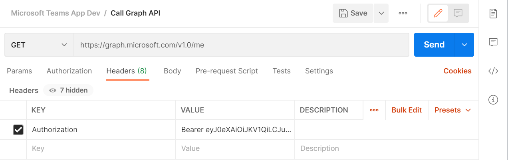

# 演習 3 : Graph API を使用したログイン済ユーザーのプロファイル情報の取得
演習 2 で取得したアクセストークンを使用して Graph API を呼び出します。

Graph API の[ユーザーの取得](https://docs.microsoft.com/ja-jp/graph/api/user-get) 機能を呼び出し、現在ログインしているユーザーのプロファイル情報を列挙します。

## タスク 1

アプリケーションのコードに変更を加える前に、アプリケーションが入手したアクセストークンと Graph API の動作を確認する方法として、[Postman](https://www.postman.com/) を使用する方法を紹介します。

Postman は HTTP クライアントをエミュレーションするツールで、REST API の動作の確認などに使用できます。

具体的な手順は以下のとおりです。

1. Postman を起動し、初期画面のダイアログボックスで \[Request\] をクリックします

2. [SAVE REQUEST] ダイアログボックスが表示されるので、\[Request name\] のボックスに **Call Graph API** と入力します

3. 同ダイアログボックス下の赤字で書かれている \[* Create Collention\] をクリックし、赤枠で囲まれたボックスに **Microsoft Teams App Dev** と記述し、右横の赤いチェック マークのボックスをクリックします

4. [Save to Microsoft App Dev] という赤いボタンが表示されるのでクリックします

5. リクエストの作成画面が表示されるので URL ボックスの前のドロップダウンリストをクリックし、HTTP メソッドが GET であることを確認します

6. URL ボックス (\[Enter request URL\] のウォーターマークがあります) にログイン済みユーザーの情報にアクセスするための Microsoft Graph API のエンドポイントである以下の URL を記述します 

    ```
    https://graph.microsoft.com/v1.0/me
    ```

7. [演習 2 のタスク 2](Ex02.md) で作成した演習用アプリケーションを実行し、表示されたアクセストークンをコピーします

8. Postman の URL ボックスの下にある \[Headers\] をクリックし、以下の KEY と VALUE を追加します

    |KEY|VALUE|
    |-|-|
    |Authorization|Bearer アクセストークン(※)|
    
    (※) Bearerと文字と数字の羅列であるアクセストークンの間に半角のスペースを指定してください

9. URL ボックス右横の \[Send\] ボタンをクリックします

    

結果 : ウインドウの右ペインの下部にユーザーのプロファイル情報が JSON で返されているのを確認します。

その他 : ウインドウの右端にある \[\</\>\] アイコンをクリックすると、今回行ったリクエストのさまざまな開発言語での呼び出しコードを確認することができます。 


## タスク 2

演習用 2 で作成した演習用のアプリケーションに Graph API を呼び出す機能を追加します。

具体的な手順は以下のとおりです。

1. 演習用 2 で作成した演習用のアプリケーションを Visual Studio Code でオープンします

2. index.html 内の head タグの最後(閉じタグの直前の行)に以下のタグを追加します

    ```
    <script src="graph.js"></script>
    ```

3. キーボードの\[Ctrl\]キーを押下しながら追加したタグの **graph.js** の部分をクリックします

4. "Unable to open 'graph.js'" と書かれたメッセージボックスが表示れるので \[Create File\] ボタンをクリックします

5. graph.js ファイルが作成され、編集状態になるのでエディタ画面に以下のコードを貼り付けます

    ```
    //ログイン済ユーザーのプロファイル情報を取得
    function getUserProfile(){
        //ログイン済ユーザーアカウントのプロファイル情報を取得する Graph API のエンドポイント
        const endpoint_GraphAPI = 'https://graph.microsoft.com/v1.0/me';
        //セッションストレージからアクセストークンを取得
        const accessToken =  sessionStorage.getItem('accessToken');
        callGraphAPI(endpoint_GraphAPI,accessToken,showPropertyName_and_Value);
    }

    //HTTP リクエストを送信
    function callGraphAPI(endpoint, token, callback) {
        const headers = new Headers();
        //Authorization ヘッダーに Bearer + アクセス Token で API にアクセス
        const bearer = `Bearer ${token}`;

        headers.append('Authorization', bearer);

        const options = {
            method: 'GET',
            headers: headers
        };

        console.log('request made to Graph API at: ' + new Date().toString());

        fetch(endpoint, options)
            .then(response => response.json())
            .then(response => callback(response))
            .catch(error => console.log(error))
    }
    
    /*演習 4-4 ステップ 4 でここにコードを追加*/
    ```

6. index.html を開きコメント "\<\!--このコメントを演習 3-2 のステップ 6 のタグで置き換え--\>" を以下のタグで置き換えます
    ```
    <button id="userProfileButton">プロファイル情報の取得</button>
    <br /><br />
    ```
7. script タグ内の "\/\*このコメントを演習 3-2 のステップ 7 のコードで置き換え*/" を以下のコードで置き換えます
    ```
    $id('userProfileButton').addEventListener('click', getUserProfile);
    ```

    キーボードの\[Ctrl\] + \[Shift\] + \[F\] キーを押下し、コードのインデントを整形後、キーボートの\[Crlt\] + \[S\]を押下して index.html への変更を保存します

8.  Visua Studio Code のメニュー\[Terminal\]-\[New Terminal\]をクリックし、表示されたターミナル画面に以下のコマンドを記述してキーボードの\[Enter\] キーを押下して http-server (ローカルWebサーバー)のサービスを開始します
    ```
    http-server
    ```
9. Web ブラウザーを起動し、Azure Active Airectory にアプリケーションとして登録した URL である[http://localhost:8080/index.html](http://localhost:8080/index.html) にアクセスします

10. ページ内の \[ログオン\] ボタンをクリックするとサインインイン用のポップアップウィンドウが表示されるので \[アカウントを選択\]の場合はアプリケーションを登録した Azure Active Airectory のアカウントを選択してログインします

11. ページ内の \[プロファイル情報の表示\] ボタンをクリックします

結果 : 

ブラウザー内にログインしたユーザーの表示名とアカウント名、プロファイル情報が表示されます。

以上で演習用アプリケーションへの Graph API を使用したログイン済ユーザーのプロファイル情報を取得する機能の実装は完了です。

[⇒ 次へ : 演習 4 : Graph API を使用した OneDrive へのファイルの投稿](Ex04.md)

[⇒ 戻る](Readme.md)


