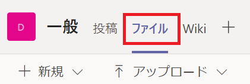

# 演習 5 : Microsoft Teams チャネルへのファイルの投稿

演習 4 で作成した演習用アプリケーションを変更して Microsoft Teams のチャネルにファイルを投稿する機能を実装します。

「Teams チャネル」と書いていますが、じつは Teams 自体はストレージを持っていません。Teams の各チームには SharePoint Online にチーム サイトがあり、チーム内の各チャネルには既定のチームサイト ドキュメント ライブラリが作成されます。

よって、実際にファイルをアップロードする先は Teams のチャネルに紐づいた SharePoint のサイトになります。

なお、Teams のプライベートチャットでやりとりされるファイルは SharePoint ではなく、送信者の OneDrive for Business のフォルダに格納されます。

Microsoft Teams のストレージ関連の情報について詳しく知りたい場合は、以下のドキュメントの内容をご参照ください。

- [Microsoft Teams の制限事項と仕様 - ストレージ](https://docs.microsoft.com/ja-jp/microsoftteams/limits-specifications-teams#storage)
- [Microsoft Teams との SharePoint Online と OneDrive for Business の連携](https://docs.microsoft.com/ja-jp/microsoftteams/sharepoint-onedrive-interact)


今回、ファイルをアップロードする先は SharePoint のサイトですが、使用する Graph API は演習 4 と同じ以下の API を使用します。

- [DriveItem の内容をアップロードまたは置換する](https://docs.microsoft.com/ja-jp/graph/api/driveitem-put-content?view=graph-rest-1.0)

ただし、使用するエンドポイントは以下となり、**Sites.ReadWrite.All** のアクセス許可が必要です。

```
PUT /groups/{group-id}/drive/items/{parent-id}:/{filename}:/content
```

## タスク 1 : Teams 用 Graph API を使用するのに必要な ID の取得

Graph API を介して Microsoft Teams のチームやチャネルにアクセスする場合、多くの場合チームやチャネルの ID を引数として指定する必要があります。この ID は Microsoft Teams の各チームやチャネルのリンクに含まれているものもあり、これらについては API をコールしなくても取り出すことができます。

しかしリンクに含まれない ID は Graph API を使用してアイテムを列挙して取得する必要があります。

このタスクでは、ファイルを投稿する対象のチームのリンクから、以降の演習で使用する ID を取り出し、ファイルを投稿するチャネルに紐づいた SharePoint へのパスを作成します。

### 1-1 group-id の取得

チームに割り振られたユニークな ID である、APIエンドポイントの書式における**group-id**を取得します。

この group-id はチームのリンクから取得することができます。

具体的な手順は以下のとおりです。

1. Microsoft Teams を起動します

2. 画面左のチームツリーで、目的のチーム名の右横にある \[・・・\]\(その他のオプション\)メニューをクリックし、\[このチャネルへのリンクを取得\] を選択します

    

3. \[チームへのリンクを取得\] ダイアログボックスが表示されるので \[コピー\]ボタンをクリックします

4. コピーしたリンクをメモ帳などのテキストエディタに貼り付け、リンク内の **groupId=** 以降の GUID 部分を抜き出します

これがエンドポイントの group-id になります。

余談ですが、チームツリーの下のチャネルのリンクを取得してもチャネルのIDである、APIエンドポイントの書式におけるparent-idは含まれていません。


### 1-2 parent-id の取得

チームの下にあるチャネルのIDである、APIエンドポイントの書式におけるparent-idを取得します

このparent-idを取得するには Graph API を使用する必要がありますが、このためにコードを記述するのは大変なので  [Graph Explorer](https://developer.microsoft.com/ja-jp/graph/graph-explorer) を使用します。

Graph Explorer は、Microsoft Graph に対して要求したり、応答を表示したりできるツールで、コードを記述しなくても GUI でGraph API を試すことができます。

このタスクでは Graph Explorer から[driveItem の子を一覧表示する機能](https://docs.microsoft.com/ja-jp/graph/api/driveitem-list-children?view=graph-rest-1.0&tabs=http)の API をコールし、列挙されたアイテムから目的のチャネルを探し、その ID をメモします。

この Graph API を呼び出す書式には、以下のように手順 1-1 で入手した group-id を使用します。

```
/groups/{group-id}/drive/root/children
```

ここでは group-id に紐づいたチーム配下のチャネルを列挙し、ファイルと投稿する目的のチャネルの id を取得します。

具体的な手順は以下のとおりです。

1. Web ブラウザーから [Graph Explorer](https://developer.microsoft.com/ja-jp/graph/graph-explorer) にアクセスします

    画面左の \[認証\] の下に **現在、サンプル アカウントを使用しています。 自分のデータにアクセスするには:** と表示されている場合は\[Microsoft の職場のアカウントまたは学校のアカウントで\] ボタンをクリックしてログインしてください。

2. Graph Explorer の右ペインの \[クエリの実行\] ボタンの左側にある URL ボックスに以下の URL を記述して\[クエリの実行\] ボタンをクリックします。なお、URL ボックスの左隣にある HTTP メソッドを指定するドロップダウンリストボックスの内容が \[GET\]であることを確認してください

    ```
    https://graph.microsoft.com/v1.0/groups/手順1-1で入手したgroup-id/drive/root/children
    ```
   
3. \[応答のプレビュー\] にチーム配下のアイテムの情報が JSON で列挙されるので、**name** 属性の値が目的のチャネル名と一致するもの\("一般" は name 属性が "General"になっているようです\)を探し、**id 属性の値**をコピーします

これがエンドポイントの parent-id になります。

よって、チャネル(に紐づいた SharePoint サイト)へファイルをアップロードするためのエンドポイントは以下のようになりますが、

```
PUT /groups/手順1-1で入手したgroup-id/drive/items/手順1-2で入手したparent-id:/{filename}:/content
```

パスが正しいかどうか確認したい場合は、目的のチャネルになにかファイルを投稿しておき、Graph Explorer から以下の API を実行し、アップロードしたファイルが検出されるか確認することができます。

```
GET /groups/手順1-1で入手したgroup-id/drive/items/手順1-2で入手したparent-id/children
```

## タスク 2 : 検証用アプリケーションへのアクセス許可の追加

アプリケーションから Microsoft Teams のチームと紐づいた SharePoint サイトにファイルをアップロードするには **Sites.ReadWrite.All** のアクセス許可が必要です。

Azure Active Airectory へのアクセス許可設定は Azure Portal から行います。

具体的な手順は以下のとおりです。

1. Azure のポータルにログインします

2. 左のメニューより **\[Azure Active Directory\]** を選択します

3. Azure Active Airectory のブレードより **\[アプリの登録\]** をクリックします

4. Azure Active Airectory に登録済のアプリの一覧が表示されるので、目的のアプリ名をクリックします

    なお、このハンズオンで作成したアプリの名前は**Sample_GraphAPI_App**です

5. 画面左のブレードから **\[API のアクセス許可\]** をクリックします

6. 画面右のペインで **\[+ アクセス許可の追加\]** をクリックします

7. 画面右に \[API アクセス許可の要求\]ブレードが表示されるので、\[Microsoft API\] タブの中の **\[Microsoft Graph\]**タイルをクリックします

8. "アプリケーションに必要なアクセス許可の種類"の画面になるので \[委任されたアクセス許可\]タイルをクリックします

9. 表示されたアクセス許可のリストから **\[Sites\]** をクリックし **\[Sites.ReadWrite.All\]** にチェックをつけ\[アクセス許可の追加\] ボタンをクリックします

    \[API アクセス許可の要求\]ブレードが閉じ、追加したアクセス許可の名前がリストに表示されていますが、まだ有効になっていません。有効にするためにはテナント管理者の同意が必要です。

10. 前の手順で追加したアクセス要求を有効にするために \[+ アクセス許可の追加\] の右隣にある **\[(現在のAADテナント名)に管理者の同意を与えます\]**をクリックして同意を付与します。

     \[(現在のAADテナント名)に管理者の同意を与えます\]が淡色表示の場合は、テナントの管理者に連絡して同意を付与してもらうか、Azure Active Airectory のテナントが作成できる場合は、自分で作成した Azure Active Airectory テナントで作業してください。

11. アクセス許可のリストに表示されている **\[Sites.ReadWrite.All\]** の \[状態\]フィールドに、有効であることを示すグリーンのインジケーターアイコンが表示されていることを確認します

以上で Azure Active Airectory でのアプリケーションへのアクセス許可の追加は完了です。

これにより、アプリケーションのコードから **Sites.ReadWrite.All** のアクセス許可を要求することができます。


## タスク 3 : 演習用アプリケーションへの、SharePoint サイトへのファイルアップロード機能の実装

演習用アプリケーションに Graph API を使用した SharePoint サイトへのファイルアップロード機能を実装します。

このコードの実装にかかるコードの変更はわずかです。

具体的な手順は以下のとおりです。

1. 演習用アプリケーションを Visual Stdio Code でオープンします

2. aadAuth.js をオープンし、変数 **loginRequest** に指定しているオブジェクトの scopes プロパティの配列に文字列として **Sites.ReadWrite.All** を追加します

    具体的には以下のように変更します

    ```
    const loginRequest = {
        scopes: ["openid", "profile", "User.Read","Files.ReadWrite","Sites.ReadWrite.All"]
    }
    ```

3. index.html の script タグ内の sendFileButton のイベントハンドラ内の変数の値を以下のように変更します

    ```
    targetDrive = 'groups/手順1-1で入手したgroup-id/drive/items/手順1-2で入手したparent-id:',
    ```
        (※) parent-id の後ろに : (セミコロン) をかならず付加してください

4. Visual Studio Code のメニュー\[Terminal\]-\[New Terminal\] を選択しターミナル画面を表示します

6. 以下のコマンドを実行して演習用アプリケーションをホストします

    ```
    http-server
    ```

7. Web ブラウザーで http://localhost:8080/index.html にアクセスし、表示された \[ログイン\]ボタンをクリックし Azure Active Directory にログインします

8. ブラウザー内の \[ファイルの選択\] ボタンをクリックして演習用に用意したファイルを選択します

9. \[アップロード\] ボタンが表示されるのでクリックします

10. ブラウザー内にアップロードしたファイルの情報が未フォーマットのJSONとして表示されるのを確認します 

11. Teams アプリケーション画面で、目的のチャネルの \[ファイル\]タブをクリックします

    

結果 : 

目的の Microsoft Teams のチャネルに紐づいた SharePoint にファイルがアップロードされています。

また、ファイルアップロード完了後にブラウザーに表示された未フォーマットの JSON の内容から以下を確認し、また、これらの値は以降のタスクで使用するので、メモ帳に貼り付けるなどして保持してください。

- **name** 属性にアップロードしたファイル名が指定されているか
- **WebUrl** 属性に指定されている URL にアクセスしてアップロードしたファイルにアクセスできるか
- **@microsoft.graph.downloadUrl** 属性に指定されている URL にアクセスしてファイルがダウンロードされるか

うまくいかない場合は[ここのサンプル](samples/ex05)を参考にしてください。


## タスク 4 : Teams チャネルへのメッセージの投稿

前のタスクの処理で Teams チャネルと紐づいた SharePoint サイトのアップロードされたファイルへのリンクを含んだメッセージを投稿します。

### 4-1 メッセージ投稿用 API の URL の生成

この処理には以下の Graph API をします。

- [チャネルで chatMessage を作成する](https://docs.microsoft.com/ja-jp/graph/api/channel-post-message?view=graph-rest-1.0)

この API の HTTP 要求は以下ですが、指定する必要のある id の説明はドキュメントに記載されていません。

```
POST /teams/{id}/channels/{id}/messages
```

この 2 つの **id** は、それぞれ異なるもので、前の id がチームにつけられたユニークな id で後ろがチャネルにつけられた id です。

この 2 つの id はチャネルとチャネルに投稿されているメッセージのリンクから取得することができますが、チャネルのリンクに含まれる id は記号がエンコードされているためそのままは使用できません。

よって今回はチャネルに投稿されている**メッセージのリンクから取得します**。

具体的な手順は以下のとおりです。

1. 目的のチャネルに投稿されているメッセージにマウスポインタをホバーすると現れるアイコンバーの右端にある \[・・・\]\(その他のオプション\)メニューをクリックし、\[リンクをコピーする\] を選択します。

    

    クリップボードにコピーされるので、メモ帳のようなテキストエディタにリンクを貼りつけます

2. チームの id と チャネルの id を取り出します

    リンクの中のクエリーストリング tenantId に指定されているものが、チームの id で、\https\://teams.microsoft.com/l/message/ から **@thread.tacv2 を含む**次の / までの部分がチャネルの id です

    具体的に例を上げるとリンクの内容は以下のようになっています。

    ```
    https://teams.microsoft.com/l/message/チャネルのid/1608183424899?tenantId=テナントのid&groupId=チームのid&parentMessageId=1608183424899&teamName=Demo&channelName=Teams%20%E9%96%8B%E7%99%BA&createdTime=1608183424899
    ```

3. 取得したチャネルの id とチームの id を使用して、チームのチャネルにメッセージを投稿する API の エンドポイントのURLを以下のように生成します
    
    /teams/**チームのid**/channels/**チャネルのid**/messages
    


### 4-2 メッセージ投稿のためのアクセス許可の追加

アプリケーションから Teams のチャネルにメッセージを投稿するには、Azure Active Direcroty でアプリケーションに対し **ChannelMessage.Send** のアクセス許可を設定しておく必要があります。

この設定を [タスク 2 : 検証用アプリケーションへのアクセス許可の追加](Ex05.md#%E3%82%BF%E3%82%B9%E3%82%AF-2--%E6%A4%9C%E8%A8%BC%E7%94%A8%E3%82%A2%E3%83%97%E3%83%AA%E3%82%B1%E3%83%BC%E3%82%B7%E3%83%A7%E3%83%B3%E3%81%B8%E3%81%AE%E3%82%A2%E3%82%AF%E3%82%BB%E3%82%B9%E8%A8%B1%E5%8F%AF%E3%81%AE%E8%BF%BD%E5%8A%A0) の手順を参考に、Azure Active Directory で登録されているアプリケーション **Sample_GraphAPI_App** に対し行います。


検証用アプリケーションのログイン時のコードでも**ChannelMessage.Send** のアクセス許可の追加を行います。

手順については [タスク 3 : 演習用アプリケーションへの、SharePoint サイトへのファイルアップロード機能の実装](Ex05.md#%E3%82%BF%E3%82%B9%E3%82%AF-3--%E6%BC%94%E7%BF%92%E7%94%A8%E3%82%A2%E3%83%97%E3%83%AA%E3%82%B1%E3%83%BC%E3%82%B7%E3%83%A7%E3%83%B3%E3%81%B8%E3%81%AEsharepoint-%E3%82%B5%E3%82%A4%E3%83%88%E3%81%B8%E3%81%AE%E3%83%95%E3%82%A1%E3%82%A4%E3%83%AB%E3%82%A2%E3%83%83%E3%83%97%E3%83%AD%E3%83%BC%E3%83%89%E6%A9%9F%E8%83%BD%E3%81%AE%E5%AE%9F%E8%A3%85) の内容を参考に以下のようにコードを変更してください。

```
const loginRequest = {
    scopes: ["openid", "profile", "User.Read","Files.ReadWrite","Sites.ReadWrite.All", "ChannelMessage.Send"]
}
```

Teams のチャネルにメッセージを投稿する処理は、今回は Postman で行うのでコードの変更はここまでです。


### 4-3 Teams チャネルへのシンプルなメッセージの投稿

検証用アプリケーションアプリケーションのログイン処理で入手したアクセストークンと Postman を使用してして Teams チャネルにメッセージを投稿します。

(※)この処理は Graph Explorer でも出来そうですが、私の環境ではいくら試しても成功しませんでしたので、Postman を使用することをお勧めします。

まず初めに、シンプルなテキストのみを投稿して動作確認を行います。

具体的な手順は以下のとおりです。

1. 検証用アプリケーションを起動しログイン処理を行い、表示されたアクセストークンをメモします

2. Postman を起動します

3. Postman のメニュー\[Workspces\] から \[My Workspace\] を選択します

4. 画面の左側のコレクションの一覧に演習 3 のタスク 1 で作成した **Microsoft Teams App Dev** があるので、名前の上でマウスの右ボタンをクリックし、表示されたコンテキストメニューから \[**Add Request**\] を選択します

5. コレクション名の下に \[**New Request**\] というアイテムが作成されるので、名前の上でマウスの右ボタンをクリックし、表示されたコンテキストメニューから \[**Rename**\] を選択して名前を **Post message to Teams Channel** に変更します

6. 右ペインに表示されている\[Upload to OnDrive\]タブ内の HTTP メソッドのドロップダウンリストボックスを\[GET\]から **\[POST\]** に変更します

7. HTTP メソッドのドロップダウンリストボックスの右隣りにある URL ボックスにタスク 4-1 で生成した Graph API のエンドポイントを以下の書式で指定します

    ```
    https://graph.microsoft.com/v1.0/teams/**チームのid**/channels/**チャネルのid**/messages
    ```

8. URL ボックス下の \[Body\] をクリックし、その下のメニューバーの \[raw\] オプションボタンをチェックすると、同じメニューバーの右端にドロップダウンリストボックスが表示されるので \[JSON\]を選択します   

    また、その下のテキストエリアに以下の JSON を記述します。これがチャネルに投稿されるメッセージの内容になります。

    ```
    {
        "body": {
            "content": "Hello World"
        }
    }
    ```


8. URL ボックスの下にある \[Headers\] をクリックし、以下の KEY と VALUE を追加します

    |KEY|VALUE|
    |-|-|
    |Authorization|Bearer アプリケーションで取得したアクセストークン(※)|
    
    (※) Bearerと文字と数字の羅列であるアクセストークンの間に半角のスペースを指定してください

9. URL ボックス右横の \[Send\] ボタンをクリックします

結果 :

Teams の目的のチャネルに "Hello World" と書かれたメッセージが投稿されています。

失敗する場合は以下を参考に設定や記述を確認してください

- HTTP 404 が返る

    エンドポイントの URL が正しいか確認してください

- Access denied\(アクセス拒否が返る) 

    Azure Active Directory で **Sample_GraphAPI_App** アクセス許可がされていないか、有効になっていません。

    Azure ポータルから Azure Active Directory の設定画面に入り、演習用アプリケーションの\[API のアクセス許可\]画面に**Sample_GraphAPI_App** がリストされているか、リストされている場合は \[状態\]フィールドに緑色のインジケーターがあるか確認してください

- Bad request あるいは Internal server error が返る
    
    送信している JSON のフォーマットに誤りがないか確認してください

### 4-4 Teams チャネルへのファイル添付メッセージの投稿

Teams チャネルへファイルが添付されたメッセージを投稿します。

添付されるファイルは前もってチャネルに紐づいた SharePoint サイトにアップロードされている必要があるので、実際はそのファイルへの参照を持った JSON をメッセージとして投稿することになります。

**GUIDの生成**

ファイルが添付されたメッセージの JSON の記述には GUID が必要になるので、これからの手順を開始する前になんらかの方法で GUID 
を生成しておいてください。

Windows 10 を使用している場合は PowerShell を起動し、以下のコマンドを実行することで GUID を生成することかできます。

```
powershell -Command "[Guid]::NewGuid()"
```

なお、ファイルが添付されたメッセージの投稿に使用された GUID は処理が成功すると、同じ処理には使えなくなるので新しく生成する必要があります。

**ファイル添付メッセージのJSONの記述** 

ファイルが添付されたメッセージの JSON を記述します。

手順は以下のとおりです。

1. 以下のサンプル JSON の中の % の付いた部分を[タスク 3]Ex05.md#%E3%82%BF%E3%82%B9%E3%82%AF-3--%E6%BC%94%E7%BF%92%E7%94%A8%E3%82%A2%E3%83%97%E3%83%AA%E3%82%B1%E3%83%BC%E3%82%B7%E3%83%A7%E3%83%B3%E3%81%B8%E3%81%AEsharepoint-%E3%82%B5%E3%82%A4%E3%83%88%E3%81%B8%E3%81%AE%E3%83%95%E3%82%A1%E3%82%A4%E3%83%AB%E3%82%A2%E3%83%83%E3%83%97%E3%83%AD%E3%83%BC%E3%83%89%E6%A9%9F%E8%83%BD%E3%81%AE%E5%AE%9F%E8%A3%85) で取得した JSON の値で置き換えます。なお、今回添付されるファイルは画像ファイルを想定しています。

    対応は以下のようになります。

    |投稿用 JSON|設定値|
    |-|-|
    |%downloadUrl%|@microsoft.graph.downloadUrlc属性の値|
    |%GUID%|生成した GUID|
    |%WebUrl%|WebUrl属性の値|
    |%fileName%|name属性|

    ```
    {
        "body": {
            "contentType": "html",
            "content": "<div>画像を投稿しましたよ。</div><div></div><attachment id=\"%GUID%\"></attachment>""
        },
        "attachments": [
            {
                "id": "%GUID%",
                "contentType": "reference",
                "contentUrl": "%WebUrl%",
                "name": "%fileName%"
            }
        ]
    }
    ```
2. タスク 4-4 で使用した Postman の **Post message to Teams Channel** をオープンし、リクエスト Body のテキストボックスに記述されている "Hello World" 用の JSON を前の手順で編集した JSON で置き換えます。

3. リクエスト ヘッダーの Authorization の内容を演習用アプリケーションから取得した最新のアクセストークンで置き換え \[Send\] ボタンをクリックします。

結果

Microsoft Teams 目的のチャネルに以下のような画像が添付されたメッセージが投稿されます。


**【既知の問題】**
メッセージ中の添付ファイルアイコンの \[・・・\]\(添付ファイルオプション\) メニューの \[ブラウザーで開く\]、\[リンクを取得\]は正常に動作しますが \[ダウンロード\] は失敗します。

これについて現在調査中で、回避策が解り次第アップデートします。

[⇒ 次へ : まとめ](summary.md)

[⇒ 戻る](Readme.md)